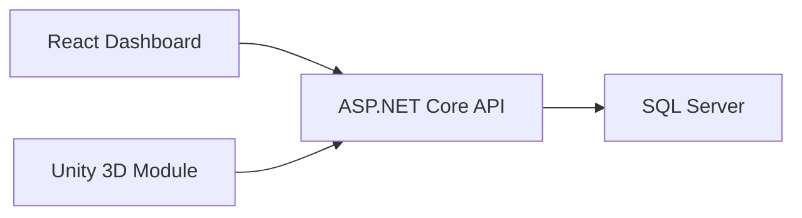

# Network Management and Simulation Platform

A web-based platform for managing virtual network topologies, device inventories, operational status, and network connections.

The project presents a business-style network management tool where users can create and manage network environments such as corporate labs, branch offices, factories, or datacenters. It includes an interactive topology editor, editable device data, saved network layouts, and a technical foundation prepared for a future ASP.NET Core, SQL Server, React, and Unity architecture.

## Features

- Interactive dashboard with network status metrics.
- Multiple saved topologies: Corporate Lab, Factory Network, Branch Office, and Datacenter.
- Device inventory with name, type, IP address, and status.
- Editable devices, including name, IP address, and online/warning/offline status.
- Editable topology name and description.
- Drag-and-drop network topology editor.
- Device creation for routers, switches, servers, PCs, and printers.
- Visual connections between network devices.
- Local data persistence in the browser.
- Planned backend persistence with ASP.NET Core and SQL Server.
- Planned Unity module for 3D network visualization.

## Technologies

- HTML
- CSS
- JavaScript
- React
- C#
- ASP.NET Core
- Entity Framework Core
- SQL Server
- Unity

## Project Structure

```text
NetSimPro/
  backend/NetSimPro.Api/       ASP.NET Core REST API foundation
  frontend/                    React dashboard foundation
  prototype/                   Functional browser prototype
  sql/                         SQL Server schema
  unity/Assets/Scripts/        Unity C# scripts for 3D topology rendering
  docs/                        Architecture, API contract, and roadmap
```

## Current Status

The functional prototype is available in:

```text
prototype/index.html
```

It currently runs directly in the browser and stores changes locally. The prototype demonstrates the main product experience before moving the data layer to a real backend and database.

## Planned Architecture

The intended full version uses a React frontend connected to an ASP.NET Core REST API. SQL Server stores users, networks, devices, links, and metrics. Unity is planned as an optional visualization module that can load topology snapshots from the API and render them in a 3D lab environment.



## Roadmap

- Replace browser localStorage with ASP.NET Core API persistence.
- Store networks, devices, links, and metrics in SQL Server.
- Connect the React dashboard to backend endpoints.
- Add authentication and user-owned networks.
- Add historical metrics and reporting views.
- Add Unity-based 3D visualization for saved topologies.

## Purpose

This project brings together frontend development, backend API design, database modeling, and 3D visualization around one coherent technical product: a network management and simulation platform.