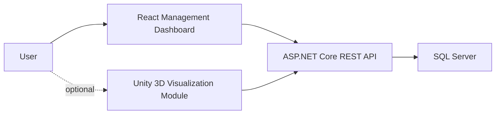

# Network Management and Simulation Platform Architecture

## Product Goal

Network Management and Simulation Platform is designed as a professional network management and simulation application. Its main purpose is to manage virtual network assets, topology layouts, device metadata, and operational status in a realistic business-style application.

The simulation and Unity 3D visualization features are planned as extensions on top of the management platform, not as a full Cisco Packet Tracer replacement.

## High-Level Components

## Current Prototype Responsibilities

- Manage multiple saved topologies in the browser.
- Add, move, connect, and delete network devices.
- Edit device name, IP address, and status.
- Edit topology name and description.
- Persist changes locally with localStorage.

## Backend Responsibilities

- Expose REST endpoints for networks, devices, links, and metrics.
- Persist data in SQL Server.
- Validate topology changes and device data.
- Provide topology snapshots to React and Unity.
- Support authentication and user-owned networks in later phases.

## React Responsibilities

- Provide the main management interface.
- Display saved topologies, inventory tables, forms, and metrics.
- Call the ASP.NET Core API instead of localStorage.
- Keep the dashboard efficient and business-oriented.

## SQL Server Responsibilities

- Store users, networks, devices, links, and device metrics.
- Preserve topology history and saved configurations.
- Support reporting queries for dashboards and statistics.

## Unity Responsibilities

- Load topology snapshots from the API.
- Render PCs, servers, switches, routers, printers, and racks in a 3D lab.
- Visualize links, status, and traffic.
- Optionally send edited positions back to the API.

## Data Flow

1. A user creates or loads a topology in React.
2. React reads and writes network data through the ASP.NET Core API.
3. The API persists networks, devices, links, and metrics in SQL Server.
4. Unity requests topology snapshots from the same API for 3D visualization.
5. React displays operational metrics and inventory status.

## Positioning

A practical description for GitHub or a CV:

> Network Management and Simulation Platform is a professional network management and simulation project developed with C#, ASP.NET Core, SQL Server, and React, featuring topology editing, device inventory management, operational metrics, and an optional Unity 3D visualization module.